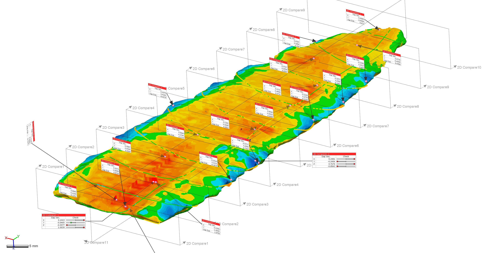

# 3dprints

This article, entitled "Morphological Variation in Three-Dimensional Printed Replicas," was published in [CRHR Research Reports](https://scholarworks.sfasu.edu/crhr_research_reports/vol4/iss1/3/) in 2018 (open access). The LaTeX scripts are included in this repository, and can be viewed on [Overleaf](https://www.overleaf.com/read/mzmvrbpptktw). Unprocessed data have been uploaded to the Open Science Framework, and the processed meshes to Zenodo @ CERN. Those data are embargoed for a period of five years, as the analysis of these bifaces is ongoing.

### Abstract

Employed primarily for outreach and education, the three-dimensional (3D) printer used in this analysis provides a means of producing tangible models of fragile and restricted-use specimens for students from a wide variety of disciplines, and is used here to produce prints associated with historic and prehistoric cultural objects. Recognizing that inconsistencies occur in 3D prints due to environmental variables, this exploratory effort was aimed at identifying the geometry that deviates most from the original scan data. A total of five replicas were printed then compared by calculating the gap distance between the nominal (original scan data) and measured data (scan of 3D printed replica) in Geomagic Control X. Results indicate that computer-aided inspection may prove useful in the refinement of 3D printing work flows, finishing, and the iterative refinement of 3D printer settings for specific real-world education- and outreach-based endeavors.